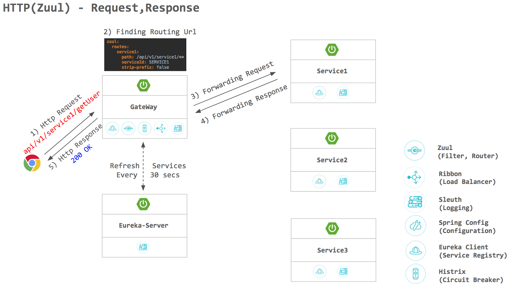

# Zuul
> Spring Cloud Netflix Zuul 예제 코드

Monolithic 과 다르게 Microservice 는 많은 API 서비스들이 있고 서로 연계되어 client의 요청을 처리한다.
이런 분산 서비스 환경에서는 다음과 같은 이슈가 발생 할 수 있다.

UI에서 여러 서비스들을 직접 호출하게 됨

Auto scaling으로 인해 host, port 정보가 동적으로 변경 됨

API 서비스들에 대해 각각 인증, CORS 처리 등을 해야 함

API 서비스들이 다양한 프로토콜을 갖게 될 수 있음

API 서비스들이 언제든 합쳐지거나 쪼개질 수 있음

Zuul Filter나 Zuul의 라우팅 서비스를 사용하여 위 이슈들을 모두 해결 할 수 있다.(Eureka 포함)

## Getting started

- System Requirements

    | Type      	| Tool         	| Version      	|
    |-----------	|--------------	|--------------	|
    | Compiler  	| JDK         	| 1.8 이상     	|
    | Builder   	| maven        	| 3.2 이상     	|
    | Framework 	| Spring Boot  	| 2.0.2        	|
    |           	| Spring Cloud 	| Finchley.RELEASE 	|

- Screenshot
    

## Related Links

- [MSA CoE Guide](https://coe.gitbook.io/guide/gateway/zuul)

- [Official site](https://github.com/Netflix/zuul/wiki)
